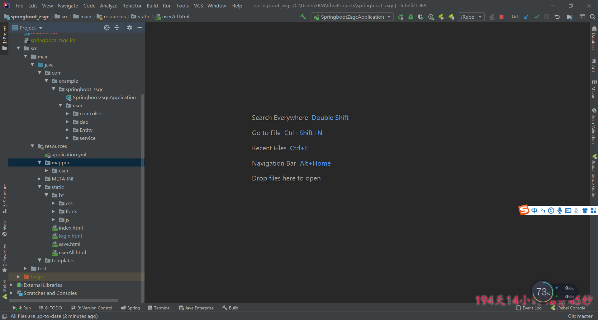
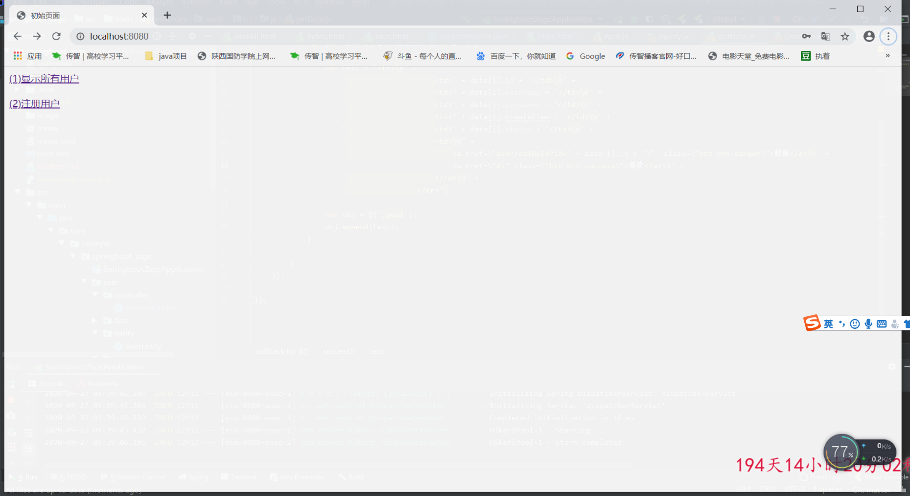
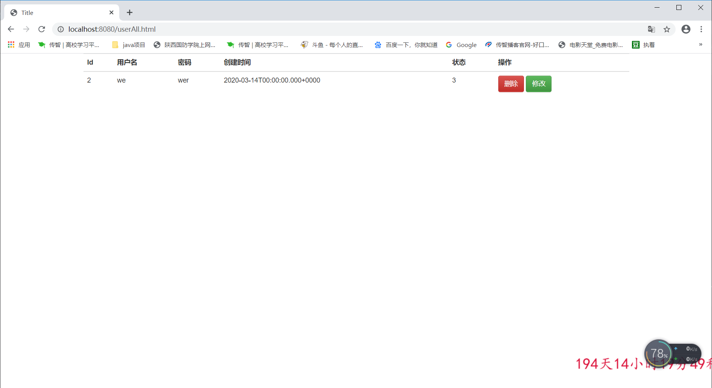

# springboot增删改查 
## 项目介绍
基于java，springboot，mybatis,html，thymeleaf，js等技术编写
供个人或者他人学习用
# 说明： 
本项目是刚学习springbooot时练手项目
# 本项目我后期会持续更新，如有想要源码的小伙伴可加我qq：632834571。
# 系统出现问题或者bug可直接联系我
# 本人博客：
http://www.dsfbm.top/ 

# 本人另一个项目
https://github.com/dsfbm/sys_power
# 项目地址
http://39.101.195.158:8888/
登录账号密码：
# 管理员账号：admin  密码：admin
# 普通用户账号：fbm  密码：123456 
 

# 项目图片展示
## 项目架构

## 首页

